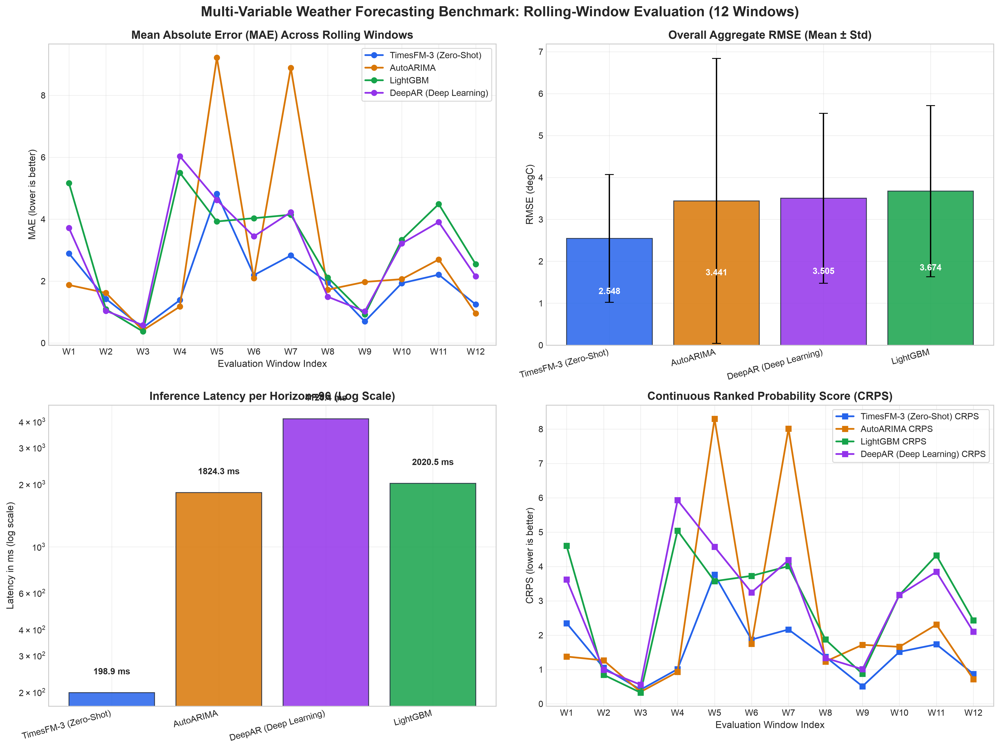
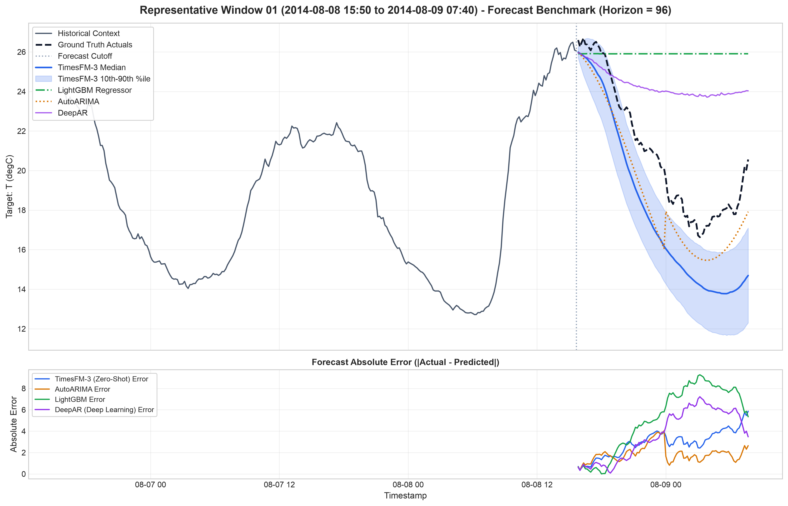

# TimesFM-3 Multi-Variable Forecasting Benchmark

Benchmark experiment evaluating Google TimesFM-3 zero-shot foundation model against classical statistical, gradient boosted tree, and deep learning forecasting architectures on the Weather multi-variable dataset across a 12-window rolling evaluation protocol.

## Benchmark Overview

This repository benchmarks time series models under standardized context lengths and prediction horizons across multiple temporal regimes and weather seasons.

### Problem Formulation

- Dataset: Jena Climate Weather 10-Minute Resolution Benchmark (2009–2016)
- Evaluation Setup: 12 rolling test windows sampled evenly across seasonal partitions
- Context Window: 512 historical time steps (~3.55 days)
- Prediction Horizon: 96 forecast time steps (16 hours)
- Target Series: T (degC) (Temperature)
- Past-Only Covariates: p (mbar), rh (%), wv (m/s), Tdew (degC), VPdef (mbar), rho (g/m**3)
- Past-Future Covariates: hour_sin, hour_cos, dayofweek_sin, dayofweek_cos, dayofyear_sin, dayofyear_cos

## Evaluated Models

- TimesFM-3 (Zero-Shot): Google foundation model (`google/timesfm-3.0-pytorch`) predicting median point forecasts and 9 quantile intervals (10th to 90th percentile) using cross-attention over multivariate past and future covariates.
- AutoARIMA: Classical statistical benchmark fitted via stepwise parameter search with dynamic calendar exogenous regressors.
- LightGBM / Tree Boosting: Gradient boosted decision trees using lag features, rolling statistics, and future calendar covariate steps.
- DeepAR (Deep Learning): Recurrent neural network with Gaussian likelihood head trained on context sequences using Monte Carlo predictive sampling.

## Aggregate Benchmark Results (12 Rolling Windows)

| Model                  | MAE (Mean ± Std) | RMSE (Mean ± Std) | WAPE   | CRPS   | 80% Coverage | Interval Width | Latency (ms)     |
| ---------------------- | ---------------- | ----------------- | ------ | ------ | ------------ | -------------- | ---------------- |
| TimesFM-3 (Zero-Shot)  | 2.0059 ± 1.1591  | 2.5476 ± 1.5231   | 0.2546 | 1.5513 | 72.1%        | 4.8345         | 198.92 ± 5.13    |
| AutoARIMA              | 2.8903 ± 2.9391  | 3.4413 ± 3.4002   | 0.3549 | 2.4675 | 55.0%        | 4.3245         | 1824.26 ± 620.90 |
| DeepAR (Deep Learning) | 2.9532 ± 1.6917  | 3.5048 ± 2.0260   | 0.3516 | 2.8800 | 10.2%        | 0.5777         | 4125.40 ± 170.41 |
| LightGBM               | 3.1359 ± 1.7098  | 3.6738 ± 2.0397   | 0.3744 | 2.8996 | 12.9%        | 1.1912         | 2020.48 ± 347.49 |

## Window-by-Window Error Breakdown

| Window    | Period (UTC)                         | TimesFM-3 MAE | AutoARIMA MAE | LightGBM MAE | DeepAR MAE |
| --------- | ------------------------------------ | ------------- | ------------- | ------------ | ---------- |
| Window 01 | 2014-08-08 15:50 to 2014-08-09 07:40 | 2.8944        | 1.8738        | 5.1656       | 3.7142     |
| Window 02 | 2014-10-22 06:30 to 2014-10-22 22:20 | 1.4255        | 1.6170        | 1.0877       | 1.0379     |
| Window 03 | 2015-01-04 05:30 to 2015-01-04 21:20 | 0.4968        | 0.4088        | 0.3720       | 0.5784     |
| Window 04 | 2015-03-19 04:20 to 2015-03-19 20:10 | 1.3863        | 1.1764        | 5.4999       | 6.0320     |
| Window 05 | 2015-06-01 03:20 to 2015-06-01 19:10 | 4.8224        | 9.2170        | 3.9272       | 4.6180     |
| Window 06 | 2015-08-14 02:20 to 2015-08-14 18:10 | 2.1910        | 2.0945        | 4.0315       | 3.4437     |
| Window 07 | 2015-10-27 01:10 to 2015-10-27 17:00 | 2.8275        | 8.8855        | 4.1435       | 4.2261     |
| Window 08 | 2016-01-09 00:10 to 2016-01-09 16:00 | 1.9482        | 1.7228        | 2.1158       | 1.4931     |
| Window 09 | 2016-03-22 23:10 to 2016-03-23 15:00 | 0.6950        | 1.9729        | 0.9189       | 1.0217     |
| Window 10 | 2016-06-04 22:00 to 2016-06-05 13:50 | 1.9322        | 2.0624        | 3.3343       | 3.2140     |
| Window 11 | 2016-08-17 21:00 to 2016-08-18 12:50 | 2.2083        | 2.6970        | 4.4881       | 3.9075     |
| Window 12 | 2016-11-02 22:10 to 2016-11-03 14:00 | 1.2436        | 0.9555        | 2.5460       | 2.1522     |

## TimesFM-3 Uncertainty Assessment (Aggregate)

- Nominal Coverage Target: 80.00% (10th to 90th percentile)
- Empirical Interval Coverage: 72.14%
- Average Interval Width: 4.8345
- Quantile CRPS: 1.5513

## Visual Comparisons

### Cross-Window Rolling Benchmark Summary



### Representative Forecast (Window 01)



Individual plots and metric CSVs for all 12 evaluation windows are archived in [`results/windows/`](results/windows/).

## Procedure and Workflow

1. Data Ingestion: Download and cache Jena Climate dataset, clean anomalous values, and compute cyclical timestamp features (`hour_sin`, `hour_cos`, `dayofweek_sin`, etc.).
2. Rolling Window Extraction: Extract 12 evenly distributed windows, each with 512 context steps and 96 future horizon steps.
3. Partitioning: Separate columns into Target, Past-Only Covariates, and Past-Future Covariates.
4. Model Inference: Execute predictions across all 4 model classes under identical historical context and future horizon inputs for each window.
5. Evaluation: Compute MAE, RMSE, WAPE, CRPS, 10th-90th coverage calibration, and inference latency per window and in aggregate.
6. Visualization & Reporting: Generate per-window comparison plots (`results/windows/`), cross-window summary plots (`results/rolling_benchmark_summary.png`), summary CSVs, uncertainty JSON metrics, and auto-update this documentation.

## Installation and Reproduction

### Prerequisites

Install `uv` (Fast Python package and project manager).

### Running the Benchmark

```bash
uv sync
uv run python run_benchmark.py
```

### Running Tests

```bash
uv run pytest tests/
```

### Code Formatting

```bash
uv run black .
```
